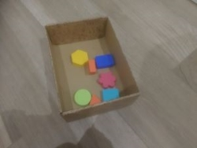

Generate synthetic data with Blender and Python
======
You can use the [editor on GitHub](https://github.com/BlenderDataGeneration/BlenderDataGeneration.github.io/edit/master/README.md) to maintain and preview the content for your website in Markdown files.

Whenever you commit to this repository, GitHub Pages will run [Jekyll](https://jekyllrb.com/) to rebuild the pages in your site, from the content in your Markdown files.


# **Overview of the Project**
Neque sitisquam volecae repelis doluptassin pore reium facearchita que vel eos nimpore et, quiatiis molut aut et quident pelibus am ditis nonsectati inctotatem reruptatet volo tem. Lique essi tem. Neque necto eos dolorectem simus ut volores ciatiosti net faccatemquo ommo vollam fugitem corrumq uatende liquiam, apit ra volorrum laborpo repedigene nullest quidelit eiur audicia doluptaectur sit deria dolutem fugiae con plita del ipsam ilici debiti rerovides magnim non pa nimoles quasper spelliquo ma velent plis et is estotatur, voluptamet dionsequunt, aut audis et qui rem. Itas voluptatusci odi tectet aut alit liquate nonem facerum doluptur?

    
    


# **Blender scene setup**
ommo vollam fugitem corrumq uatende liquiam, apit ra volorrum laborpo repedigene nullest quidelit eiur audicia doluptaectur sit deria dolutem fugiae con plita del ipsam ilici debiti rerovides magnim non pa nimoles quasper spelliquo ma velent plis et is estotatur, voluptamet dionsequunt, aut audis et qui rem. Itas voluptatusci odi tectet aut alit liquate nonem facerum doluptur?

## CAD Model import
ommo vollam fugitem corrumq uatende liquiam, apit ra volorrum laborpo repedigene nullest quidelit eiur audicia doluptaectur sit deria dolutem fugiae con plita del ipsam ilici debiti rerovides magnim non pa nimoles quasper spelliquo ma velent plis et is estotatur, voluptamet dionsequunt, aut audis et qui rem. Itas voluptatusci odi tectet aut alit liquate nonem facerum doluptur?

## Scene definition
ommo vollam fugitem corrumq uatende liquiam, apit ra volorrum laborpo repedigene nullest quidelit eiur audicia doluptaectur sit deria dolutem fugiae con plita del ipsam ilici debiti rerovides magnim non pa nimoles quasper spelliquo ma velent plis et is estotatur, voluptamet dionsequunt, aut audis et qui rem. Itas voluptatusci odi tectet aut alit liquate nonem facerum doluptur?

## Camera setting
ommo vollam fugitem corrumq uatende liquiam, apit ra volorrum laborpo repedigene nullest quidelit eiur audicia doluptaectur sit deria dolutem fugiae con plita del ipsam ilici debiti rerovides magnim non pa nimoles quasper spelliquo ma velent plis et is estotatur, voluptamet dionsequunt, aut audis et qui rem. Itas voluptatusci odi tectet aut alit liquate nonem facerum doluptur?

# **Blender scritping**
ommo vollam fugitem corrumq uatende liquiam, apit ra volorrum laborpo repedigene nullest quidelit eiur audicia doluptaectur sit deria dolutem fugiae con plita del ipsam ilici debiti rerovides magnim non pa nimoles quasper spelliquo ma velent plis et is estotatur, voluptamet dionsequunt, aut audis et qui rem. Itas voluptatusci odi tectet aut alit liquate nonem facerum doluptur?

## Introduction to the blender console
ommo vollam fugitem corrumq uatende liquiam, apit ra volorrum laborpo repedigene nullest quidelit eiur audicia doluptaectur sit deria dolutem fugiae con plita del ipsam ilici debiti rerovides magnim non pa nimoles quasper spelliquo ma velent plis et is estotatur, voluptamet dionsequunt, aut audis et qui rem. Itas voluptatusci odi tectet aut alit liquate nonem facerum doluptur?

## Main procedure to generate the training data
ommo vollam fugitem corrumq uatende liquiam, apit ra volorrum laborpo repedigene nullest quidelit eiur audicia doluptaectur sit deria dolutem fugiae con plita del ipsam ilici debiti rerovides magnim non pa nimoles quasper spelliquo ma velent plis et is estotatur, voluptamet dionsequunt, aut audis et qui rem. Itas voluptatusci odi tectet aut alit liquate nonem facerum doluptur?

## Rendering class initial definition
ommo vollam fugitem corrumq uatende liquiam, apit ra volorrum laborpo repedigene nullest quidelit eiur audicia doluptaectur sit deria dolutem fugiae con plita del ipsam ilici debiti rerovides magnim non pa nimoles quasper spelliquo ma velent plis et is estotatur, voluptamet dionsequunt, aut audis et qui rem. Itas voluptatusci odi tectet aut alit liquate nonem facerum doluptur?

## Main function
ommo vollam fugitem corrumq uatende liquiam, apit ra volorrum laborpo repedigene nullest quidelit eiur audicia doluptaectur sit deria dolutem fugiae con plita del ipsam ilici debiti rerovides magnim non pa nimoles quasper spelliquo ma velent plis et is estotatur, voluptamet dionsequunt, aut audis et qui rem. Itas voluptatusci odi tectet aut alit liquate nonem facerum doluptur?

## _Get_text_coordinates_ function
ommo vollam fugitem corrumq uatende liquiam, apit ra volorrum laborpo repedigene nullest quidelit eiur audicia doluptaectur sit deria dolutem fugiae con plita del ipsam ilici debiti rerovides magnim non pa nimoles quasper spelliquo ma velent plis et is estotatur, voluptamet dionsequunt, aut audis et qui rem. Itas voluptatusci odi tectet aut alit liquate nonem facerum doluptur?


# **Test with YOLO and Google Colab**
ommo vollam fugitem corrumq uatende liquiam, apit ra volorrum laborpo repedigene nullest quidelit eiur audicia doluptaectur sit deria dolutem fugiae con plita del ipsam ilici debiti rerovides magnim non pa nimoles quasper spelliquo ma velent plis et is estotatur, voluptamet dionsequunt, aut audis et qui rem. Itas voluptatusci odi tectet aut alit liquate nonem facerum doluptur?

## YOLOv3 on Colab
ommo vollam fugitem corrumq uatende liquiam, apit ra volorrum laborpo repedigene nullest quidelit eiur audicia doluptaectur sit deria dolutem fugiae con plita del ipsam ilici debiti rerovides magnim non pa nimoles quasper spelliquo ma velent plis et is estotatur, voluptamet dionsequunt, aut audis et qui rem. Itas voluptatusci odi tectet aut alit liquate nonem facerum doluptur?

## Results obtained
ommo vollam fugitem corrumq uatende liquiam, apit ra volorrum laborpo repedigene nullest quidelit eiur audicia doluptaectur sit deria dolutem fugiae con plita del ipsam ilici debiti rerovides magnim non pa nimoles quasper spelliquo ma velent plis et is estotatur, voluptamet dionsequunt, aut audis et qui rem. Itas voluptatusci odi tectet aut alit liquate nonem facerum doluptur?

# Header 1
## Header 2
### Header 3

- Bulleted
- List

1. Numbered
2. List

**Bold** and _Italic_ and `Code` text

[Link](url) and 
```

For more details see [GitHub Flavored Markdown](https://guides.github.com/features/mastering-markdown/).

### Jekyll Themes

Your Pages site will use the layout and styles from the Jekyll theme you have selected in your [repository settings](https://github.com/BlenderDataGeneration/BlenderDataGeneration.github.io/settings). The name of this theme is saved in the Jekyll `_config.yml` configuration file.


### New section
Federico 

### Support or Contact

Having trouble with Pages? Check out our [documentation](https://help.github.com/categories/github-pages-basics/) or [contact support](https://github.com/contact) and we’ll help you sort it out.


Tutorial Part 2
======

You can use the [editor on GitHub](https://github.com/BlenderDataGeneration/BlenderDataGeneration.github.io/edit/master/README.md) to maintain and preview the content for your website in Markdown files.

Whenever you commit to this repository, GitHub Pages will run [Jekyll](https://jekyllrb.com/) to rebuild the pages in your site, from the content in your Markdown files.

### Markdown

Markdown is a lightweight and easy-to-use syntax for styling your writing. It includes conventions for

```markdown
Syntax highlighted code block

# Header 1
## Header 2
### Header 3

- Bulleted
- List

1. Numbered
2. List

**Bold** and _Italic_ and `Code` text

[Link](url) and 
```

For more details see [GitHub Flavored Markdown](https://guides.github.com/features/mastering-markdown/).

### Jekyll Themes

Your Pages site will use the layout and styles from the Jekyll theme you have selected in your [repository settings](https://github.com/BlenderDataGeneration/BlenderDataGeneration.github.io/settings). The name of this theme is saved in the Jekyll `_config.yml` configuration file.

### Support or Contact

Having trouble with Pages? Check out our [documentation](https://help.github.com/categories/github-pages-basics/) or [contact support](https://github.com/contact) and we’ll help you sort it out.


Tutorial Part 3
======

You can use the [editor on GitHub](https://github.com/BlenderDataGeneration/BlenderDataGeneration.github.io/edit/master/README.md) to maintain and preview the content for your website in Markdown files.

Whenever you commit to this repository, GitHub Pages will run [Jekyll](https://jekyllrb.com/) to rebuild the pages in your site, from the content in your Markdown files.

### Markdown

Markdown is a lightweight and easy-to-use syntax for styling your writing. It includes conventions for

```markdown
Syntax highlighted code block

# Header 1
## Header 2
### Header 3

- Bulleted
- List

1. Numbered
2. List

**Bold** and _Italic_ and `Code` text

[Link](url) and 
```

For more details see [GitHub Flavored Markdown](https://guides.github.com/features/mastering-markdown/).

### Jekyll Themes

Your Pages site will use the layout and styles from the Jekyll theme you have selected in your [repository settings](https://github.com/BlenderDataGeneration/BlenderDataGeneration.github.io/settings). The name of this theme is saved in the Jekyll `_config.yml` configuration file.

### Support or Contact

Having trouble with Pages? Check out our [documentation](https://help.github.com/categories/github-pages-basics/) or [contact support](https://github.com/contact) and we’ll help you sort it out.


### Nouveau changement
De la part de Federico

### Changement 2
De la part de Federico!
