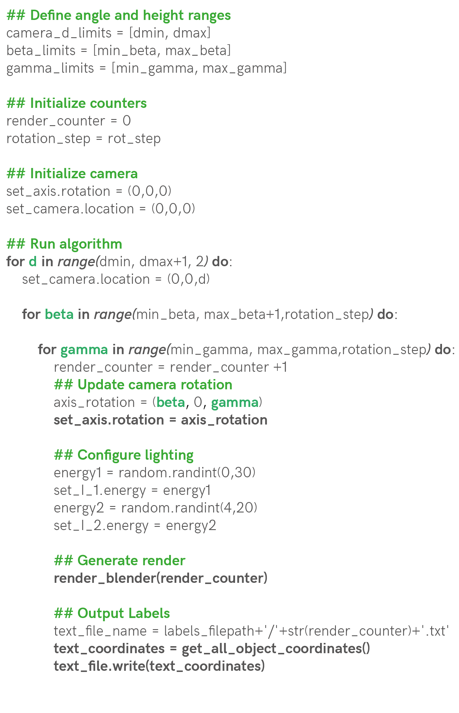
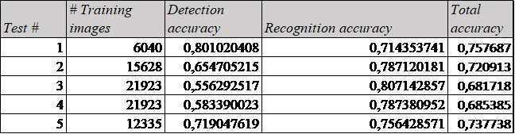

Generate synthetic data with Blender and Python
======
ommo vollam fugitem corrumq uatende liquiam, apit ra volorrum laborpo repedigene nullest quidelit eiur audicia doluptaectur sit deria dolutem fugiae con plita del ipsam ilici debiti rerovides magnim non pa nimoles quasper spelliquo ma velent plis et is estotatur, voluptamet dionsequunt, aut audis et qui rem. Itas voluptatusci odi tectet aut alit liquate nonem facerum doluptur?

ommo vollam fugitem corrumq uatende liquiam, apit ra volorrum laborpo repedigene nullest quidelit eiur audicia doluptaectur sit deria dolutem fugiae con plita del ipsam ilici debiti rerovides magnim non pa nimoles quasper spelliquo ma velent plis et is estotatur, voluptamet dionsequunt, aut audis et qui rem. Itas voluptatusci odi tectet aut alit liquate nonem facerum doluptur?

- [1. Overview of the Project](#1-overview-of-the-project)
- [2. Blender scene setup](#2-blender-scene-setup)
  * [CAD Model import](#cad-model-import)
  * [Scene definition](#scene-defintion)
  * [Camera setting](#camera-setting)
  * [CAD Model import](#cad-model-import)
- [3. Blender scritping](#3-blender-scripting)
  * [Introduction to the blender console](#introduction-to-the-blender-console)
      + [Accessing scene information](#>>-accessing-scene-information)
      + [Accessing object information](#>>-accessing-object-information)
      + [Modifying object information](#>>-modifying-object-information)
  * [Main algorithm to generate the training data](#main-procedure-to-generate-the-training-data)
  * [Rendering class initial definition](#rendering-class-initial-definition)
  * [Main algorithm implementation](#main-algorithm-to-pan-around-the-objects-and-take-pictures)
  * [Main function to extract labels](#Main-function-to-extract-labels-from-all-objects-in-image)
  * [Results obtained from the data generation](#Results-obtained-from-the-data-generation)
- [4. Test with YOLO and Google Colab](#4-test-with-yolo-and-google-colab)
  * [Results obtained](#results-obtained)
    
<!-- toc -->


# **1. Overview of the Project**
Neque sitisquam volecae repelis doluptassin pore reium facearchita que vel eos nimpore et, quiatiis molut aut et quident pelibus am ditis nonsectati inctotatem reruptatet volo tem. Lique essi tem. Neque necto eos dolorectem simus ut volores ciatiosti net faccatemquo ommo vollam fugitem corrumq uatende liquiam, apit ra volorrum laborpo repedigene nullest quidelit eiur audicia doluptaectur sit deria dolutem fugiae con plita del ipsam ilici debiti rerovides magnim non pa nimoles quasper spelliquo ma velent plis et is estotatur, voluptamet dionsequunt, aut audis et qui rem. Itas voluptatusci odi tectet aut alit liquate nonem facerum doluptur?

    
    

ommo vollam fugitem corrumq uatende liquiam, apit ra volorrum laborpo repedigene nullest quidelit eiur audicia doluptaectur sit deria dolutem fugiae con plita del ipsam ilici debiti rerovides magnim non pa nimoles quasper spelliquo ma velent plis et is estotatur, voluptamet dionsequunt, aut audis et qui rem. Itas voluptatusci odi tectet aut alit liquate nonem facerum doluptur?

# **2. Blender scene setup**
Whichever it is the object you want to recognize, in order to generate synthetic data to train its recognizor, we have to represent this or these objects in Blender. Therefore, we have to create and setup a scene that tries to resemble the most to the actual, real-life scene in which we would normally find the objects we want to recognize. 

In order to explain how to do this, in this section we'll walk the reader through the main steps that are necessary to setup a scene that's compatible with the scripting that will automate the data generation.

## **Step 1: CAD Model import**
The first step consists of importing (or creating) the objects we want to recognize into Blender. In our case, we decided to create the CAD model in Catia V5, and then import it as an .stl. It is also possible to create the model from scratch in Blender, however, as we were more fluent in Catia, we decided to do this on that software. 


_Catia environment with the assembly of the objects we aim to recognize_

We then move on to opening Blender to start importing each .stl object we want to recognize. We click in the _File_ window, then _Import_, and finally we select the _Stl(.stl)_ option, in order to import the models previously exported from Catia V5.


_Blender STL file import_

Before finishing the STL import, we have to specify that the scale would be _0.001_, since Blender works in _meters_ and Catia works in _milimiters_. This keeps the units of our model scaled to the Blender reference system, so in later stages the camera has a proportioned size compared to the imported model


_Scaling the STL model before import in Blender_

Once each object is imported into the Blender Environment, make sure to create a plane to depict the surface of the scene. Also, make sure to name every object in the _Scene Collection_ menu that can be seen in the right panel in the following image. Make sure these names are easy to write, short and united by an underscore if the name contains two words.


_Final scene with all objects imported and named_

## **Step 2: Scene definition**
Once the models are imported, we move onto defning the entiring scene in order to make it look the most realistic. The more realistic the scene is, the better our training data will be, and the better our algorithm will recognize the real-life objects we are training it to detect.

Therefore, we start by defining the materials of each object by selecting it and going into the _Material_ option in the right panel shown below. The three parameters that are key to tuning the appearance of your object are the _Base Color_, _Specular_, and _Rougness_. The las two need to be adjusted to define whether the object absorbs or reflects light, if it is shiny or matte.


_Blender object material definition Panel_

Additionnaly, and if necessary, textures can be added to the objects in the scene. These textures can be imported from an image and impose the _Base Color_ from the image. For our project, textures were added to the floor and the platform that holds the objects. A detailed guide on importing textures into Blender can be found [here](https://www.youtube.com/watch?v=r5YNJghc81U).


_Assigning textures to a Blender object_

Next, the lights were defined, the second light can be created by copying and pasting the first light, that is created automatically when the Blender scene is started. As for with the objects, make sure to assign names to these lights such as _light1_ and _light2_ that will allow you to call them easily in the code, once we get to the scripting part. 

These two lights' most important parameter is the _Power_ parameter, which will allow us to play with the intensity of the light once we get to the scripting part. In the following picture, on the right bottom part, we can see the "Light Properties" panel being open, with the _Power_ parameter on 16W.


_Blender scene with its respective lights_

Once all the materials are defined, and the lights that fit your purposes are added, we can move on to visualizing the Rendering by clicking on the top right botton circled in green in the following picture. This allows us to access the _Viewport Shading_ in _Rendered_ mode.


_Rendered objects_

Now the scene is setup! If any difficulties were found while going through this step, we encourage you to look at [a complete guide made by Blender Guru on how to set the rendering configurations in Blender](https://www.youtube.com/watch?v=ZTxBrjN1ugA) as well as [the guide on setting the materials of each object in the scene](https://www.youtube.com/watch?v=5lr8QnR5WWU&t=414s).

## **Step 3: Camera setting**
The final step to setting up the Blender scene in order to start scripting is setting up the camera! This step is actually crucial because we need to be able to easily control the camera with the scripting in order to make it move around and take pictures. We decided to make the camera orbit all around the objects to take pictures from each angle.

However, this movement isn't so evident if we think of the cubical space (x,y,z) the camera is set to move on. This means that it would be too complicated to set define a list of (x,y,z) points that describe a spherical movement around the objects. So, in order to simplify this task, we decided to create an axis fixed to the center of the scene, to which the camera would obey when it was moved. This means that when the axis is rotated in the center, the camera will rotate with it. Imagine putting your elbow in a table and moving your fist arond, the fist revolves around your elbow. Now imagine that the elbow is the axis and your fist is the camera, the camera revolves around the axis.

Consequently, we create an axis and locate it in the center of the scene, as shown below. 


_Adding an axis to the center of the scene in Blender_

Now, in order to subordinate the movement of the camera to the movement of the axis, we hold _Shift_ and select the _camera first_ and then the _axis_. Once both of them are selected, hwe hit _Ctr + P_ and select _Object (Keep Transform)_. This will make the axis a parent of the Camera.


_Set the Axis as a Parent of the Camera_

You can go ahead and test that this worked by going into _Camera view_, _selecting the axis_ and going into the _Transform window_ highlighted in green in the image below, and _changing the Rotation coordinates of the axis_. You'll see that the camera orbits the objects when the axis rotational coordinates are changed.


_Demonstration of the camera orbiting the objects_

Finally, he complete guide to how to set the camera to orbit around a specific object can be found [here](https://www.youtube.com/watch?v=ghCsEVj2CFE).

# **3. Blender scritping**
Now that the complete scene is setup, we can start with the scripting. This Blender functionality will allow us to automate the render generation in order to make tens of thousands of pictures and labels that will serve as training data for our object recognition algorithm. This is extremely powerful because this means that if we have a realist-enough Blender scene, we can generate up to 20000 images and labels in around two days (this time will vary according to the capacities of the GPU of your own machine).

This scripting functionality can be accessed by clicking in the _Scrpting_ window underlined in orange in the following picture. By clicking on this window, we-ll have three major elements come up: the _Blender Console_ shown in yellow, the _Scripting environment_ shown in orange, and the _Command tracker_ shown in green.


_Scripting window and its main components_

The _Command Tracker_ allows you to track what actual scripting commands are being used when modifying a specific parameter in the Blender environment. For example, in the following picture I modifyied the position of the Axis.

<p align="center">

</p>

_Tracking of the script used to change the position of the axis_

The _Scripting environment_ allows you to import and save previously created Python Scripts. The script in the _Scripting environment_ will be saved to an external location of your choise. Additionnally, when the script is ready, you can run it by clicking on the _Run Script_ Button


_Saving, Opening and Running your script in Blender_

Finally, once the script is ready to run, go to _Window/Toggle System Console_ to access the Console that shows the output of your code. This can be better represented in the following image.


_Toggle System Console Output_


## **Introduction to the Blender Console**
### >> **Accesing scene information**

ommo vollam fugitem corrumq uatende liquiam, apit ra volorrum laborpo repedigene nullest quidelit eiur audicia doluptaectur sit deria dolutem fugiae con plita del ipsam ilici debiti rerovides magnim non pa nimoles quasper spelliquo ma velent plis et is estotatur, voluptamet dionsequunt, aut audis et qui rem. Itas voluptatusci odi tectet aut alit liquate nonem facerum doluptur?

```python
>>> bpy.data
<bpy_struct, BlendData at 0x000001C251997458>

>>> bpy.data.scenes
<bpy_collection[1], BlendDataScenes>

>>> bpy.data.scenes[0]
bpy.data.scenes['Scene']

>>> bpy.data.scenes[1]
Traceback (most recent call last):
  File "<blender_console>", line 1, in <module>
IndexError: bpy_prop_collection[index]: index 1 out of range, size 1

>>> scene = bpy.data.scenes[0]
>>> scene
bpy.data.scenes['Scene']

```
### >> **Accesing object information**
ommo vollam fugitem corrumq uatende liquiam, apit ra volorrum laborpo repedigene nullest quidelit eiur audicia doluptaectur sit deria dolutem fugiae con plita del ipsam ilici debiti rerovides magnim non pa nimoles quasper spelliquo ma velent plis et is estotatur, voluptamet dionsequunt, aut audis et qui rem. Itas voluptatusci odi tectet aut alit liquate nonem facerum doluptur?

```python
>>> bpy.data.objects
<bpy_collection[15], BlendDataObjects>

>>> bpy.data.objects[0]
bpy.data.objects['Camera']

>>> camera = bpy.data.objects['Camera']
>>> bpy.data.objects[1]
bpy.data.objects['Carre bleu']

>>> bpy.data.objects[2]
bpy.data.objects['Conteneur coupe']

>>> bpy.data.objects[3]
bpy.data.objects['Empty']

>>> axe = bpy.data.objects[3]
>>> axe
bpy.data.objects['Empty']

>>> camera
bpy.data.objects['Camera']

>>> carre_bleu = bpy.data.objects['Carre bleu']
>>> carre_bleu
bpy.data.objects['Carre bleu']

>>> bpy.data.objects['Light']
bpy.data.objects['Light']

>>> light1 = bpy.data.objects['Light']
>>> light2 = bpy.data.objects['Light2']
>>> light1
bpy.data.objects['Light']

>>> light2
bpy.data.objects['Light2']

```

### >> **Modifying object information**
ommo vollam fugitem corrumq uatende liquiam, apit ra volorrum laborpo repedigene nullest quidelit eiur audicia doluptaectur sit deria dolutem fugiae con plita del ipsam ilici debiti rerovides magnim non pa nimoles quasper spelliquo ma velent plis et is estotatur, voluptamet dionsequunt, aut audis et qui rem. Itas voluptatusci odi tectet aut alit liquate nonem facerum doluptur?


ommo vollam fugitem corrumq uatende liquiam, apit ra volorrum laborpo repedigene nullest quidelit eiur audicia doluptaectur sit deria dolutem fugiae con plita del ipsam ilici debiti rerovides magnim non pa nimoles quasper spelliquo ma velent plis et is estotatur, voluptamet dionsequunt, aut audis et qui rem. Itas voluptatusci odi tectet aut alit liquate nonem facerum doluptur?

```python
>>> axe.rotation_euler = (0,0,0)
>>> camera.location = (0,0,0.5)
>>> light1.data.energy = 50
>>> light2.data.energy = 0
```
ommo vollam fugitem corrumq uatende liquiam, apit ra volorrum laborpo repedigene nullest quidelit eiur audicia doluptaectur sit deria dolutem fugiae con plita del ipsam ilici debiti rerovides magnim non pa nimoles quasper spelliquo ma velent plis et is estotatur, voluptamet dionsequunt, aut audis et qui rem. Itas voluptatusci odi tectet aut alit liquate nonem facerum doluptur?


ommo vollam fugitem corrumq uatende liquiam, apit ra volorrum laborpo repedigene nullest quidelit eiur audicia doluptaectur sit deria dolutem fugiae con plita del ipsam ilici debiti rerovides magnim non pa nimoles quasper spelliquo ma velent plis et is estotatur, 

```
>>> axe.rotation_euler = (0,0,50)
```

voluptamet dionsequunt, aut audis et qui rem. Itas voluptatusci odi tectet aut alit liquate nonem facerum doluptur?


## **Main procedure to generate the training data**
ommo vollam fugitem corrumq uatende liquiam, apit ra volorrum laborpo repedigene nullest quidelit eiur audicia doluptaectur sit deria dolutem fugiae con plita del ipsam ilici debiti rerovides magnim non pa nimoles quasper spelliquo ma velent plis et is estotatur, voluptamet dionsequunt, aut audis et qui rem. Itas voluptatusci odi tectet aut alit liquate nonem facerum doluptur?


ommo vollam fugitem corrumq uatende liquiam, apit ra volorrum laborpo repedigene nullest quidelit eiur audicia doluptaectur sit deria dolutem fugiae con plita del ipsam ilici debiti rerovides magnim non pa nimoles quasper spelliquo ma velent plis et is estotatur, voluptamet dionsequunt, aut audis et qui rem. Itas voluptatusci odi tectet aut alit liquate nonem facerum doluptur?



ommo vollam fugitem corrumq uatende liquiam, apit ra volorrum laborpo repedigene nullest quidelit eiur audicia doluptaectur sit deria dolutem fugiae con plita del ipsam ilici debiti rerovides magnim non pa nimoles quasper spelliquo ma velent plis et is estotatur

<p align="center">

</p>

voluptamet dionsequunt, aut audis et qui rem. Itas voluptatusci odi tectet aut alit liquate nonem facerum doluptur?


## **Rendering class initial definition**
In order to implement a program that incorporates the algorithm explained above and is able to access the information of the _Scene_ and the _Objects_ in it, we have decided to create an entire class named _Render_.

This class is initialized below. We begin by importing all the relevant libraries. _bpy_ is the library that allows us to access and modify the information of the Blender elements. During the initialization of the Render class, we define the main objects that we will be manipulating such as the camera defined as _self.camera_, the axis defined as _self.axis_, the light 1 and 2 defined as _self.light1_ and _self.light2_, and all the objects that are saved into the _self.objects_ variable. 

Finally, but most immportantly, we define the variable _self.camera_z_limits_ to move the camera from 0.3 meters to 1 meter, each 0.1 meters. We define the _self.beta_limits_ to rotate the camera along the x axis from 80º to -80º, each _rot_step_ angles. We define the _self.gamma_limits_ to rotate the camera along the x axis from 0º to 360º, each _rot_step_ angles. Also, we define the _self.images_filepath_ and _self.labels_filepath_ which will be the filepaths were the images and labels generated by our program will be saved.

```python
## Import all relevant libraries
import bpy
import numpy as np
import time
import math as m
import os
import random

class Render:
    def __init__(self):
        ## Scene information
        # Define the scene information
        self.scene = bpy.data.scenes['Scene']
        # Define the information relevant to the <bpy.data.objects>
        self.camera = bpy.data.objects['Camera']
        self.axis = bpy.data.objects['Empty']
        self.light_1 = bpy.data.objects['Light']
        self.light_2 = bpy.data.objects['Light2']
        self.obj_names = ['Fleur rose', 'Carre bleu', 'Etoile verte', 'Hexagone jaune', 'Losange orange',
                          'Ovale rose', 'Rectangle bleu', 'Rond vert', 'Triangle eq orange']
        self.objects = self.create_objects() # Create list of bpy.data.objects from bpy.data.objects[1] to bpy.data.objects[N]

        ## Rendering limits information
        self.camera_z_limits = [0.3, 1] # Define range of heights z that the camera is going to pan through
        self.beta_limits = [80, -80] # Define range of beta angles that the camera is going to pan through
        self.gamma_limits = [0, 360] # Define range of gamma angles that the camera is going to pan through
        
        ## Output information
        # Input your own preferred location for the images
        self.images_filepath = 'C:/Users/Federico Arenas/Desktop/GitHubrepo/BlenderDataGeneration.github.io/Blender/Data'
        # Input your own preferred location for the labels
        self.labels_filepath = 'C:/Users/Federico Arenas/Desktop/GitHubrepo/BlenderDataGeneration.github.io/Blender/Data/Labels'

    def create_objects(self): # This function creates a list of all the <bpy.data.objects> 
        objs = []
        for obj in self.obj_names:
            objs.append(bpy.data.objects[obj])
        
        return objs
```

## **Main algorithm to pan around the objects and take pictures**
Now, we'll add the _main_rendering_loop()_ function to the _Render_ class. This function is the implementation in Python of the algorithm shown in the previous section. By acessing the _self.camera_, _self.axis_, _self.light1_, and _self.light2_ information we'll be able to move the camera around the objects, take the pictures and extract the labels. 

Initially, by using the _self.calculate_n_renders(rot_step)_ function, we are able to calculate how many renders and labels will be created. The _rot_step_ parameter indicates each how many degrees the program is going to take a picture. The smaller _rot_step_ is, the more renders and labels will be created. We then print the information of the number of renders, and ask whether to start the rendering or not. This is important because it allows us to estimate what _rot_step_ is going to give us how many renders, if its too many, we increase the _rot_step_, if it's too little, we reduce it.

If the user hits 'Y' then the algorithm starts creating the data. It must be noted that we have to do some refactoring and adapt the initially defined limits _self.camera_z_limits_, _self.beta_limits_, and _self.gamma_limits_. This refactoring is done because the _for_ loop can't loop through decimal numbers nor through negative numbers, so we're forced to multiply by ten for the decimals, and use 10º to 170º, instead of 80º to -80º.

```python
    def main_rendering_loop(self, rot_step):
        '''
        This function represent the main algorithm explained in the Tutorial, it accepts the
        rotation step as input, and outputs the images and the labels to the above specified locations.
        '''
        ## Calculate the number of images and labels to generate
        n_renders = self.calculate_n_renders(rot_step) # Calculate number of images
        print('Number of renders to create:', n_renders)

        accept_render = input('\nContinue?[Y/N]:  ') # Ask whether to procede with the data generation

        if accept_render == 'Y': # If the user inputs 'Y' then procede with the data generation
            # Create .txt file that record the progress of the data generation
            report_file_path = self.labels_filepath + '/progress_report.txt' 
            report = open(report_file_path, 'w')
            # Multiply the limits by 10 to adapt to the for loop
            zmin = int(self.camera_z_limits[0] * 10) 
            zmax = int(self.camera_z_limits[1] * 10)
            # Define a counter to name each .png and .txt files that are outputted
            render_counter = -3
            # Define the step with which the pictures are going to be taken
            rotation_step = rot_step

            # Begin nested loops
            for d in range(zmin, zmax + 1, 2): # Loop to vary the height of the camera
                render_counter += 1 # Update the counter 
                ## Update the height of the camera 
                self.camera.location = (0, 0, d/10) # Divide the distance z by 10 to re-factor current height

                # Refactor the beta limits for them to be in a range from 0 to 360 to adapt the limits to the for loop
                min_beta = (-1) * self.beta_limits[0] + 90 
                max_beta = (-1) * self.beta_limits[1] + 90

                for beta in range(min_beta, max_beta + 1, rotation_step): # Loop to vary the angle beta
                    beta_r = 90 - beta # Re-factor the current beta
                    render_counter += 1 # Update the counter

                    for gamma in range(self.gamma_limits[0], self.gamma_limits[1] + 1, rotation_step): # Loop to vary the angle gamma
                        render_counter += 1 # Update the counter
                        
                        ## Update the rotation of the axis
                        axis_rotation = (m.radians(beta_r), 0, m.radians(gamma)) 
                        self.axis.rotation_euler = axis_rotation # Assign rotation to <bpy.data.objects['Empty']> object

                        ## Configure lighting
                        energy1 = random.randint(0, 30) # Grab random light intensity
                        self.light_1.data.energy = energy1 # Update the <bpy.data.objects['Light']> energy information
                        energy2 = random.randint(4, 20) # Grab random light intensity
                        self.light_2.data.energy = energy2 # Update the <bpy.data.objects['Light2']> energy information

                        ## Generate render
                        self.render_blender(render_counter) # Take photo of current scene and ouput the render_counter.png file

                        ## Output Labels
                        text_file_name = self.labels_filepath + '/' + str(render_counter) + '.txt' # Create label file name
                        text_file = open(text_file_name, 'w+') # Open .txt file
                        text_coordinates = self.get_all_coordinates(self.xpix * self.percentage * 0.01,
                                                                    self.ypix * self.percentage * 0.01) # Get formatted coordinates of the bounding boxes of all the objects in the scene
                        splitted_coordinates = text_coordinates.split('\n')[:-1] # Delete last '\n' in coordinates
                        text_file.write('\n'.join(splitted_coordinates)) # Write the coordinates to the text file and output the render_counter.txt file
                        text_file.close() # Close the .txt file corresponding to the label
 
                        ## Show progress on batch of renders
                        print('Progress =', str(render_counter) + '/' + str(n_renders))
                        report.write('Progress: ' + str(render_counter) + ' Rotation: ' + str(axis_rotation) + ' z_d: ' + str(d / 10) + '\n')

            report.close() # Close the .txt file corresponding to the report

        else: # If the user inputs anything else, then abort the data generation
            print('Aborted rendering operation')
            pass
```

You might have noticed that we call two functions that are created by us: _self.render_blender(render_counter)_ and _self.get_all_coordinates(resx, resy). The first function, which is included in the source code, varies the image size and definition, takes a picture and defines the _self.xpix_, _self.ypix_ and _self.percentage_  variables, which are the size of the picture taken and its scale provided in %.  This function ultimately exports the _render_counter.png_ file to the _self.images_filepath_ location.


We can see that the _resx_ and _resy_ are take these variables into account when inputted into the _self.get_all_coordinates(resx, resy)_ function. The following calculation is done to provide the final size of the image:

```
resx = final x size of the image = self.xpix * self.percentage * 0.01 # Multiply by 0.01 to divide by 100 and scale the final size
resy = final y size of the image = self.ypix * self.percentage * 0.01 # Multiply by 0.01 to divide by 100 and scale the final size
```

This second function will be further explained in the following section. Once the coordinates a recovered, they are added to the _render_counter.txt_ file created that is saved in the _self.labels_filepath_ location. 

## **Main function to extract labels from all objects in image**
The fonction _get_all_coordinates(resx, resy)_ loops through all the objects in _self.objects_ and tries to get each object's coordinates with the function _self.find_bounding_box(obj)_ which takes the current object _obj_ and if in view of the camera, outputs its coordinates. This function is further explained [here](https://olestourko.github.io/2018/02/03/generating-convnet-training-data-with-blender-1.html), and is integrated into the full code we made [here](). 

Next, if the object is found, the function _self.format_coordinates(b_box, i, resx, resy)_ reformats the coordinates from this format

    ```
    Name_of_class_0 <min_x> <min_y> <max_x> <max_y>
    Name_of_class_1 <min_x> <min_y> <max_x> <max_y>
    Name_of_class_2 <min_x> <min_y> <max_x> <max_y>
    ...
    ...
    Name_of_class_N <min_x> <min_y> <max_x> <max_y>
    ```

to this format

    ```
    0 <center_x> <center_y> <bounding_box_width> <bounding_box_height>
    1 <center_x> <center_y> <bounding_box_width> <bounding_box_height>
    2 <center_x> <center_y> <bounding_box_width> <bounding_box_height>
    ...
    ...
    N_classes <center_x> <center_y> <bounding_box_width> <bounding_box_height>
    ```

The function can be seen here:

```python
    def get_all_coordinates(self, resx, resy):
        '''
        This function takes the width and height of the image and outputs
        the complete string with the coordinates of all the objects in view in 
        the current image
        '''
        main_text_coordinates = '' # Initialize the variable where we'll store the coordinates
        for i, obj in enumerate(self.objects): # Loop through all of the objects
            b_box = self.find_bounding_box(obj) # Get current object's coordinates
            if b_box: # If find_bounding_box() doesn't return None
                text_coordinates = self.format_coordinates(b_box, i, resx, resy) # Reformat coordinates to YOLOv3 format
                main_text_coordinates = main_text_coordinates + text_coordinates # Update main_text_coordinates variables which each
                                                                                 # line corresponding to each class in the frame of the current image

        return main_text_coordinates # Return all coordinates
```

Finally, the _main_text_coordinates_ are returned as a string.

## **Results obtained from the data generation**
ommo vollam fugitem corrumq uatende liquiam, apit ra volorrum laborpo repedigene nullest quidelit eiur audicia doluptaectur sit deria dolutem fugiae con plita del ipsam ilici debiti rerovides magnim non pa nimoles quasper spelliquo ma velent plis et is estotatur, voluptamet dionsequunt, aut audis et qui rem. Itas voluptatusci odi tectet aut alit liquate nonem facerum doluptur?

```python

if __name__ == '__main__':
    r = Render() # Initialize Render() class and define it as r
    r.set_camera() # Initialize all positions of the camera and the axis
    r.main_rendering_loop(5) # Start rendering with specified rotation step (rot_step)

```
dolutem fugiae con plita del ipsam ilici debiti rerovides magnim non pa nimoles quasper spelliquo ma velent plis et is estotatur, voluptamet dionsequunt, aut audis et qui rem. Itas voluptatusci odi tectet aut alit liquate nonem facerum doluptur?


_Messages in the Toggle Console Window_

dolutem fugiae con plita del ipsam ilici debiti rerovides magnim non pa nimoles quasper spelliquo ma velent plis et is estotatur, voluptamet dionsequunt, aut audis et qui rem. Itas voluptatusci odi tectet aut alit liquate nonem facerum doluptur?


    ```
    1.png
    1.txt
    2.png
    2.txt
    3.png
    3.txt
    ...
    ...
    N.png
    N.txt
    ```

ommo vollam fugitem corrumq uatende liquiam, apit ra volorrum laborpo repedigene nullest quidelit eiur audicia doluptaectur sit deria dolutem fugiae con plita del ipsam ilici debiti rerovides magnim non pa nimoles quasper spelliquo ma velent plis et is estotatur, voluptamet dionsequunt, aut audis et qui rem. Itas voluptatusci odi tectet aut alit liquate nonem facerum doluptur?

    ```
    0 <center_x> <center_y> <bounding_box_width> <bounding_box_height>
    1 <center_x> <center_y> <bounding_box_width> <bounding_box_height>
    2 <center_x> <center_y> <bounding_box_width> <bounding_box_height>
    ...
    ...
    N_classes <center_x> <center_y> <bounding_box_width> <bounding_box_height>
    ```

ommo vollam fugitem corrumq uatende liquiam, apit ra volorrum laborpo repedigene nullest quidelit eiur audicia doluptaectur sit deria dolutem fugiae con plita del ipsam ilici debiti rerovides magnim non pa nimoles quasper spelliquo ma velent plis et is estotatur, voluptamet dionsequunt, aut audis et qui rem. Itas voluptatusci odi tectet aut alit liquate nonem facerum doluptur?

<p align="center">

</p>

# **4. Test with YOLO and Google Colab**
We decided to use the Darknet architecture using YOLOv3, and implemented in Google Colab. We downloaded the darknet architecture from [AlexeyAB's Darknet repository](https://github.com/AlexeyAB/darknet#yolo-v3-in-other-frameworks), and learned how to implement it [using this source](https://www.youtube.com/watch?v=10joRJt39Ns).


## **Results obtained**
ommo vollam fugitem corrumq uatende liquiam, apit ra volorrum laborpo repedigene nullest quidelit eiur audicia doluptaectur sit deria dolutem fugiae con plita del ipsam ilici debiti rerovides magnim non pa nimoles quasper spelliquo ma velent plis et is estotatur, voluptamet dionsequunt, aut audis et qui rem. Itas voluptatusci odi tectet aut alit liquate nonem facerum doluptur?

<p align="center">

</p>

ommo vollam fugitem corrumq uatende liquiam, apit ra volorrum laborpo repedigene nullest quidelit eiur audicia doluptaectur sit deria dolutem fugiae con plita del ipsam ilici debiti rerovides magnim non pa nimoles quasper spelliquo ma velent plis et is estotatur, voluptamet dionsequunt, aut audis et qui rem. Itas voluptatusci odi tectet aut alit liquate nonem facerum doluptur?

<p align="center">

</p>

ommo vollam fugitem corrumq uatende liquiam, apit ra volorrum laborpo repedigene nullest quidelit eiur audicia doluptaectur sit deria dolutem fugiae con plita del ipsam ilici debiti rerovides magnim non pa nimoles quasper spelliquo ma velent plis et is estotatur, voluptamet dionsequunt, aut audis et qui rem. Itas voluptatusci odi tectet aut alit liquate nonem facerum doluptur?

<p align="center">

</p>

A demonstration of the algorithm working on video can be found [here](https://www.youtube.com/watch?v=z1bx544dLs8)
